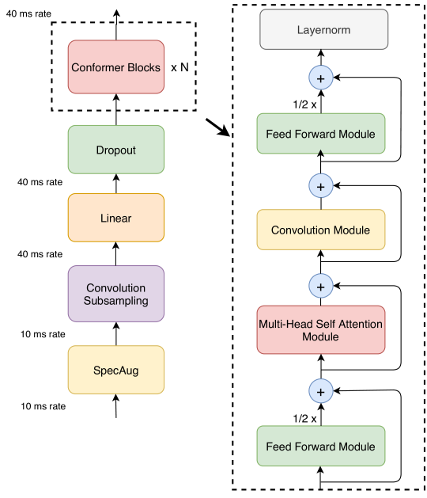
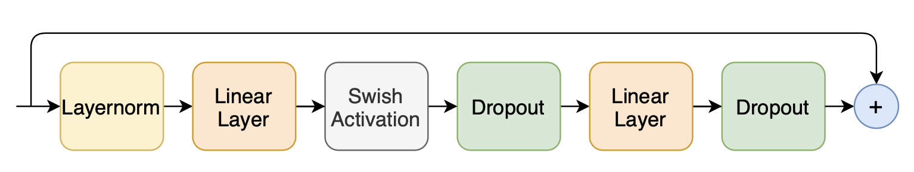
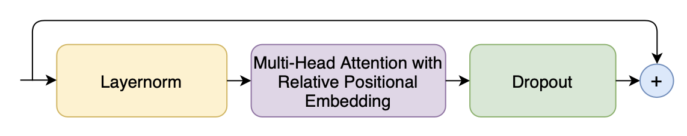
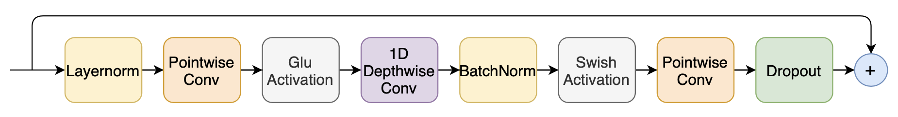

# Conformer
PyTorch Implementation: [Convolution-augmented Transformer for Speech Recognition](https://arxiv.org/abs/2005.08100)

[](https://opensource.org/licenses/Apache-2.0)
[](https://pytorch.org/)

## **Working now...**


## Introduction
This is an ASR model called **Conformer** made by Google. <br />
This paper introduces only encoder models. However, I implemented both encoder and decoder model using PyTorch.  
Encoder was implemented as conformer according to the paper, and decoder was implemented as 'Something'. 
(Decoder has not been decided which model to use)

### Conformer Architecture
 <br />
description

### Feed Forward Module
 <br />
description

### Multi-Head Self Attention Module
 <br />
description

### Convolution Module
 <br />
description


## Installation
### Usage
<h3>Train</h3>

```python
from conformer.trainer import Trainer
Trainer().fit(...)
```


## Reference
### Paper 
- **[Convolution-augmented Transformer for Speech Recognition](https://arxiv.org/abs/2005.08100)**

### Github
- **[sooftware/KoSpeech](https://github.com/sooftware/KoSpeech)**